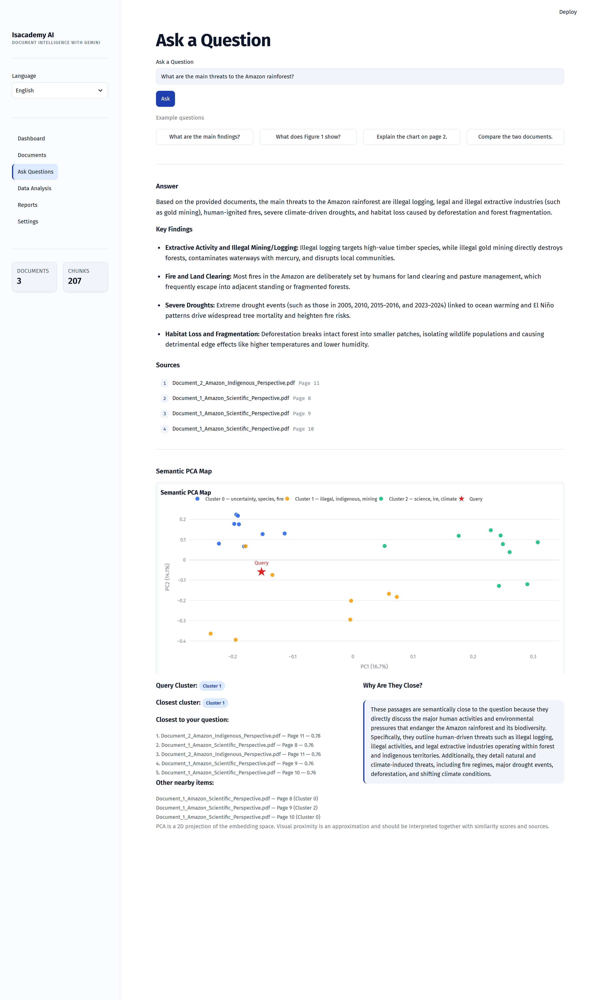
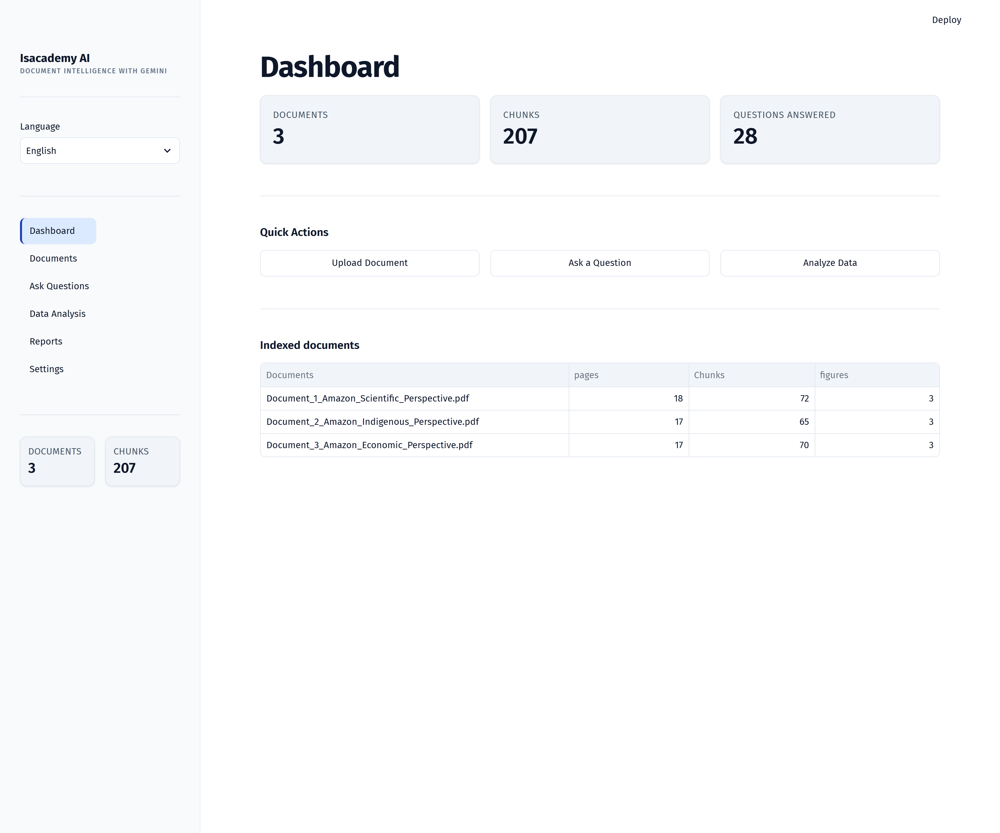
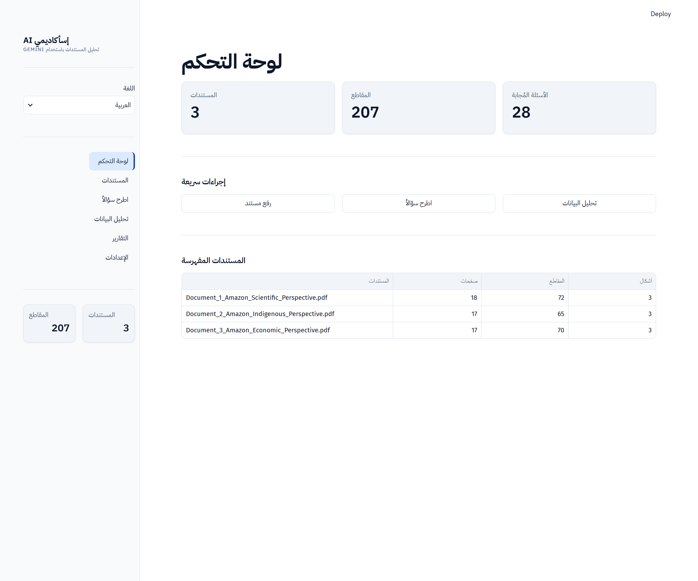

# Isacademy Capstone — Document Intelligence with Gemini

Upload PDFs, ask questions in **English or Arabic**, and get an answer that is
grounded in your documents — with real citations, the actual chart or figure
when the question is about a visual, and a semantic PCA map showing **what is
close to your question and why**.

**Gemini is the only AI provider.** No other LLM or VLM service is used.
Gemini handles question answering, image and chart understanding, cluster
explanation and report text. Embeddings run locally (they are not an LLM
provider).

---

## 1. What it does

| Ask | You get |
|---|---|
| *"What are the main findings?"* | grounded answer + sources with page numbers + semantic PCA map |
| *"What does Figure 1 show?"* | **the actual figure**, Gemini's reading of it, and the citation |
| *"Explain the chart on page 15."* | that page rendered as an image + Gemini's analysis |
| *"Which feature correlates most?"* | dataset profiling, PCA and interactive charts |
| *"ما هي أهم النتائج؟"* | the same, entirely in Arabic, right-to-left |

Two things it will not do: invent a citation, or answer a visual question with
text alone.

### One question, end to end



*A real run over three Amazon rainforest reports. The answer is written by
Gemini from retrieved passages only; every source names its document and page;
the PCA map places the question (red star) among its nearest passages, shows
which cluster it belongs to, lists the closest matches with their true cosine
similarity, and explains why they are close.*



### The same interface in Arabic



*Switching language mirrors the whole layout, swaps to IBM Plex Sans Arabic,
and translates every label — while document filenames, numbers and charts stay
left-to-right, because those read wrongly when flipped.*

Screenshots are regenerated from a live app with
`python docs/capture_screenshots.py`.

---

## 2. Architecture

```
                          USER  (English / العربية)
                            │
                            ▼
                     ┌──────────────┐
                     │  QUERY AGENT │   what kind of question is this?
                     └──────┬───────┘
          ┌────────────────┼─────────────────┐
          ▼                ▼                 ▼
     RAG SEARCH      VISUAL ANALYSIS    DATA ANALYSIS
   (Chroma + BGE)   (find the image)   (CSV / Excel PCA)
          │                │                 │
          │                ▼                 │
          │          GEMINI VISION           │
          └────────────────┼─────────────────┘
                           ▼
                    GEMINI ANALYSIS          grounded in retrieved evidence
                           ▼
              ANSWER + SOURCES + SEMANTIC PCA
                           ▼
                        REPORT               Markdown / HTML / PDF
```

Three small agents, one plain pipeline function. No agent framework — the
whole flow fits on one screen (`app/agents/pipeline.py`).

| Component | File | Job |
|---|---|---|
| Query agent | `app/agents/query_agent.py` | intent, figure/page references |
| Retrieval agent | `app/agents/retrieval_agent.py` | Chroma search + threshold |
| Analysis agent | `app/agents/analysis_agent.py` | Gemini writes the answer |
| Vision | `app/vision/gemini_vision.py` | find the visual, Gemini reads it |
| Semantic PCA | `app/analytics/semantic_pca.py` | where the question sits |
| Pipeline | `app/agents/pipeline.py` | runs the five, in order |

---

## 3. Gemini integration

One client, `app/models/gemini.py`, used for everything:

```python
get_gemini().generate(prompt, language="ar")        # text
get_gemini().analyze_image(path, prompt, language)  # vision
```

* SDK: official `google-genai`.
* Model: `GEMINI_MODEL` (default `gemini-3.6-flash`).
* Key: `GEMINI_API_KEY`
* Failures are translated into plain bilingual messages: a bad key, a quota
  limit and an unavailable model each say what to do about it.

Prompts always instruct Gemini to use only the supplied document context, and
to treat that context as data rather than as instructions.

---

## 4. RAG

```
PDF → PyMuPDF → pages (text, images, tables, page numbers kept)
    → sentence-aligned chunks (+ one chunk per table, one per figure caption)
    → BAAI/bge-small-en-v1.5 embeddings
    → ChromaDB (cosine, persistent)
    → query → top-K → similarity threshold → evidence
```

* Every chunk carries `document`, `page`, `chunk_id`, `content_type`, and —
  for figures — `image_path`. Citations are built in Python from these, so
  Gemini never writes a page number.
* Re-uploading the same file is a no-op: the document id **is** the SHA-256 of
  its bytes.
* If retrieval finds nothing above the threshold, the system says so instead
  of answering.

---

## 5. Visual analysis

A visual question always ends with something to look at:

1. **"Figure 3"** → the extracted image whose caption matches.
2. **"page 15"** → that page, rendered to PNG.
3. otherwise → the best-matching retrieved chunk's image.
4. nothing extractable → the relevant **page render** as a fallback.

The image plus the surrounding page text go to Gemini, which is told to
describe axes, series, trends and labelled values — and to say when something
is unreadable rather than guess. The UI shows the image **before** the
explanation, with its source and page.

---

## 6. Semantic PCA — "what is close to my question?"

Attempted on **every** question, automatically:

```
query embedding + the 25 nearest chunk embeddings
        │
        ├── cosine similarity  (on the FULL vectors)
        ├── KMeans clustering  (on the FULL vectors)
        └── PCA(2) fitted once, used to project BOTH documents and the query
                    │
                    ▼
     interactive Plotly map + the six answers below
```

The panel states, explicitly:

| Question | Shown as |
|---|---|
| Where is the query? | a red star on the map |
| Which cluster is it in? | **Query Cluster** |
| Which cluster is closest? | **Closest cluster** (a similarity-weighted vote) |
| Which items are closest? | ranked list with document, page and score |
| Why are they close? | Gemini's explanation, written from the real passages |
| What else is nearby? | items from other clusters |

Similarity is always computed on the original embedding vectors, never on the
2-D coordinates — and the UI says so:

> PCA is a 2D projection of the embedding space. Visual proximity is an
> approximation and should be interpreted together with similarity scores and
> sources.

If there are too few vectors, the map is skipped with a clear message and the
question is still answered normally.

**Dataset PCA is a different thing** (`app/analytics/pca.py`): it runs on real
numeric columns after imputation and `StandardScaler`, and lives on the Data
Analysis page. The two are never mixed.

---

## 7. Bilingual UI

Every user-facing string lives in `app/i18n.py`. Switching the language in the
sidebar switches navigation, buttons, headings, PCA labels, error messages and
report headings. Arabic adds RTL styling for the page chrome while leaving
Plotly charts, dataframes and code LTR, where flipping would look broken.

---

## 8. Installation

Requires **Python 3.10 or newer** (developed and tested on 3.14).

```bash
python -m venv .venv
# Windows:      .venv\Scripts\activate
# macOS/Linux:  source .venv/bin/activate

pip install -r requirements.txt
cp .env.example .env        # Windows: copy .env.example .env
```

Add your key to `.env` (get one at https://aistudio.google.com/apikey):

```env
GEMINI_API_KEY=your-key-here
```

Check everything:

```bash
python run.py --check
```

---

## 9. Environment variables

```env
GEMINI_API_KEY=              # required
GEMINI_MODEL=gemini-2.0-flash

EMBEDDING_MODEL=BAAI/bge-small-en-v1.5
EMBEDDING_LOAD_TIMEOUT=300   # first load may download ~130 MB

CHROMA_PATH=./data/vector_db
UPLOAD_DIR=./data/uploads
OUTPUT_DIR=./data/reports

TOP_K=5
SIMILARITY_THRESHOLD=0.30
CHUNK_SIZE=800
CHUNK_OVERLAP=150

PCA_NEIGHBORS=25             # chunks pulled into the semantic map
PCA_MAX_POINTS=100           # hard cap on plotted points
PCA_CLUSTERS=3

DEFAULT_LANGUAGE=en          # en | ar
MAX_UPLOAD_MB=50
ENABLE_OCR=false
```

`.env` is git-ignored. Never commit it.

---

## 10. Running

```bash
python run.py               # start the app
python run.py --demo        # build + index demo documents, then start
python run.py --check       # dependency / configuration check
```

Then open http://localhost:8501.

Pages: **Dashboard · Documents · Ask Questions · Data Analysis · Reports ·
Settings**.

---

## 11. Example questions

**English**
* What are the main findings of the research?
* What does Figure 1 show?
* Explain the chart on page 2.
* Compare the two documents.
* Which model has the highest accuracy?

**العربية**
* ما هي أهم النتائج؟
* ماذا يعرض الشكل 1؟
* اشرح الرسم البياني في صفحة 2.
* قارن بين المستندين.

---

## 12. Testing

```bash
pytest          # 102 tests
```

Tests use a throwaway data directory, force the offline embedder and run with
**no API key**, so they need no network and cost nothing. Covered: PDF
extraction and page rendering, chunking and metadata, embeddings, ChromaDB
round-trip, retrieval and citations, dedup and upload security, the query
agent (English *and* Arabic), Gemini error handling, semantic PCA (projection,
clustering, similarity, every refusal path), dataset PCA, visual location
including the page-render fallback, reports in both languages, and the UI
itself — navigation, language switching and the answer/PCA panels — through
Streamlit's headless `AppTest`.

---

## 13. Project structure

```
app/
├── agents/          query_agent · retrieval_agent · analysis_agent · pipeline
├── analytics/       semantic_pca · pca · clustering · similarity · plots
│                    preprocessing · data_detector · visualizations
├── document_processing/  pdf_extractor · image_extractor · table_extractor
│                         document_loader · processor · metadata
├── models/          gemini · schemas
├── rag/             embeddings · vector_store · chunker
├── reports/         generator · pdf_generator · templates/
├── ui/              streamlit_app · pages
├── vision/          gemini_vision
├── utils/           logging · file_utils · helpers
├── config.py        every setting, read once
└── i18n.py          every string, in both languages
data/   uploads · images · datasets · vector_db · reports · processed
demo/   make_demo_data.py   (two PDFs with a real chart + a CSV)
tests/  102 tests
```

---

## 14. Troubleshooting

| Symptom | Fix |
|---|---|
| "No Gemini API key configured" | Add `GEMINI_API_KEY` to `.env`, restart. |
| "Gemini rejected the API key" | The key is wrong or expired. |
| "model … is not available for this key" | Set `GEMINI_MODEL` to one you can access. |
| Quota / rate limit | Free-tier limit reached; wait or upgrade. |
| Answers say there is not enough information | Nothing scored above `SIMILARITY_THRESHOLD` — rephrase, or lower it in Settings. |
| Slow first start | The embedding model is downloading (~130 MB). Later starts reuse the cache; `HF_HUB_OFFLINE=1` skips the update check entirely. |
| Embeddings show `hashing-fallback` | `sentence-transformers` could not load — retrieval still works but matches words, not meaning. |
| PDF produced no text | It is a scanned PDF: set `ENABLE_OCR=true` and `pip install easyocr`. |
| Re-upload does nothing | Working as designed (content-hash dedup). Tick **Force re-index**. |
| Arabic PDF report looks wrong | Known limitation — see below. Use HTML or Markdown for Arabic. |

---

## 15. Known limitations

* **Arabic PDF export**: reportlab's built-in fonts do not shape Arabic script.
  Arabic reports are correct in Markdown and HTML; the PDF is best for English
  (registering an Arabic TTF in `pdf_generator.py` would fix it).
* **Every AI feature needs a Gemini key.** Without it, indexing, retrieval,
  sources, clustering and the PCA map all still work; the written answer, the
  visual analysis and the cluster explanation report a missing key rather than
  producing anything.
* Table extraction relies on PyMuPDF; heavily merged or nested tables may be
  missed.
* The semantic map plots a neighbourhood (`PCA_NEIGHBORS`), not the whole
  corpus — that is a deliberate performance choice.
* Clustering on a very small corpus is noisy; with only a handful of chunks the
  cluster labels mean little.
* OCR is optional and off by default.

---

## License

Released under the [MIT License](LICENSE).
